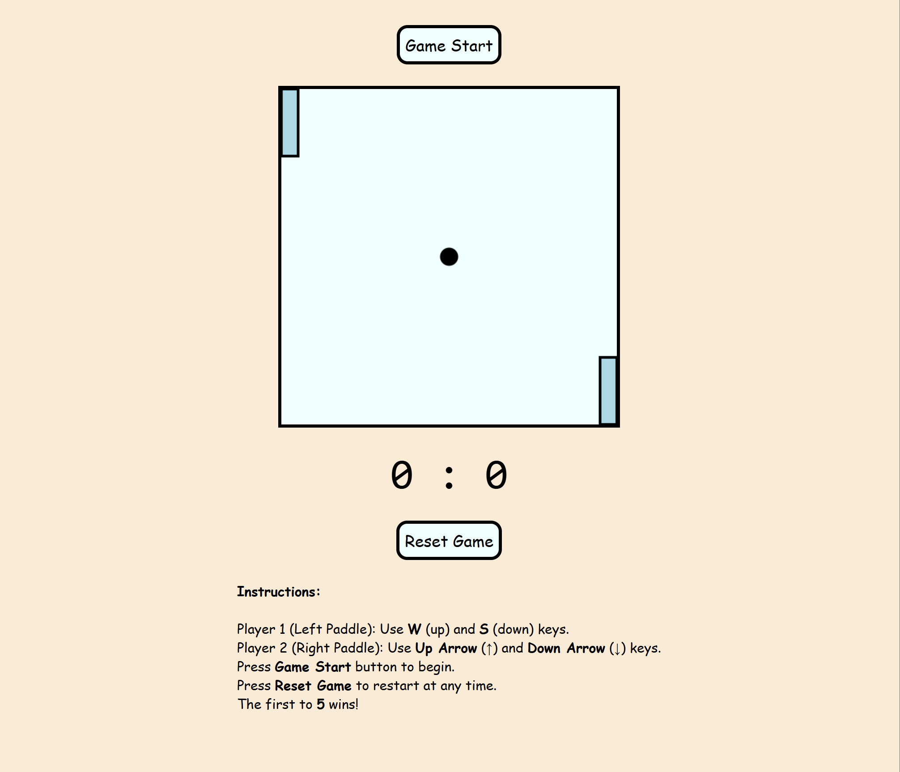

# 🏓 Pong Web Game

> **A classic Pong game built with HTML, CSS, and JavaScript.**

---

<!-- Pong Banner -->
<p align="center">
  
</p>

---

<p align="center">
  
  
  
  
</p>

---

## 📑 Table of Contents

1. [Introduction](#-introduction)
2. [Tech Stack](#-tech-stack)
3. [Features](#-features)
4. [Quick Start](#-quick-start)
5. [Screenshots](#-screenshots)
6. [Deployment](#-deployment)
7. [About](#-about)

---

## 🚀 Introduction

Pong is one of the earliest arcade video games. This web version is simple, fun, and playable in your browser. Crafted to bring a dash of retro fun to your screen and showcase creative, interactive web development.

---

## 🛠️ Tech Stack

- **HTML5** – Semantic markup for structure
- **CSS3** – Custom styles and animations
- **JavaScript** – Game logic and DOM manipulation

---

## ✨ Features

- 🕹️ **Classic Gameplay:** Two-player Pong experience
- 🎨 **Retro UI:** Clean and retro-inspired
- 🏆 **Score Tracking:** First to 5 wins
- 🔄 **Instant Restart:** Play again with one click
- 🧩 **No Dependencies:** Just open and play

---

## 👌 Quick Start

1. **Clone the repository:**
   ```bash
   git clone https://github.com/Mikepin23/pong.git
   cd pong
   ```
2. **Open `index.html` in your browser.**

---


## 💻 Try It Yourself

This project is live and playable:

[🌐 Demo Now](https://pong-m833.onrender.com/)

---

## 👤 About

Created by **Michael Pinsonneault**

- [Portfolio](https://portfolio-michael-pinsonneault.onrender.com)
- [GitHub](https://github.com/Mikepin23)
- [LinkedIn](https://www.linkedin.com/in/michael-pinsonneault)

> Thank you for checking out my project!
